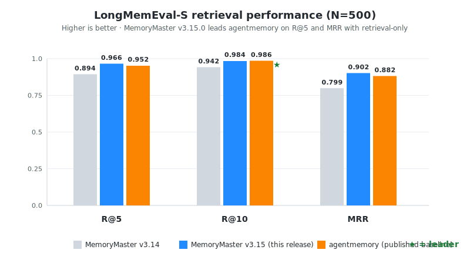

# MemoryMaster

**Production-grade memory reliability system for AI coding agents.**

Lifecycle-managed claims with citations, conflict detection, steward governance, hybrid retrieval, and MCP integration. Give your AI agents persistent, trustworthy memory.

[](LICENSE)
[](https://www.python.org/downloads/)
[]()
[]()
[]()
[](https://pypi.org/project/memorymaster/)

MemoryMaster prevents the #1 problem with agent memory: **drift, stale assumptions, and unsafe disclosure**. It gives Claude Code, Codex, and any MCP-compatible agent persistent, verifiable memory with a full claim lifecycle, citation tracking, conflict detection, and human-in-the-loop governance.

### How it's different

Most agent-memory systems (mem0, Letta/MemGPT, Zep) optimize for **storing and recalling more** — embeddings, summaries, a fast vector store. MemoryMaster optimizes for **trusting what you recall**. The differentiator is **governance**: every memory is a lifecycle-managed *claim*, not an opaque embedding.

| | mem0 / Letta / Zep | **MemoryMaster** |
|---|---|---|
| Unit of memory | text chunk / summary | **claim** with status, tier, citations, bitemporal validity |
| Stale / wrong facts | linger until overwritten | **decay → `stale`**, **conflict detection**, **supersession** |
| Contradictions | silently coexist | surfaced as **`conflicted`**, auto-resolved (5-tier) or queued for review |
| Provenance | usually none | **citation per claim** + per-agent provenance |
| Secret leakage | your problem | **sensitivity filter at ingest** (JWT/AWS/Bearer/SSH redaction) |
| Operator control | API only | **steward governance** + a **dashboard** you can *see* |

If you want an agent that recalls more, any vector store works. If you want an agent that recalls *correctly* — and can prove where a fact came from and retire it when it goes stale — that's the gap MemoryMaster fills.

---

## Architecture

MemoryMaster is layered around MCP/CLI entry points, the `MemoryService` facade, SQLite/Postgres
storage, optional Qdrant vector search, scheduled jobs, and the Obsidian wiki/vault layer. The
canonical ingest path is:

```text
MCP/CLI -> sensitivity filter -> MemoryService.ingest -> store write -> FTS5 index
```

The query path is:

```text
query_memory -> MemoryService.query -> storage reads + optional Qdrant candidates -> ranked context
```

See [docs/architecture.md](docs/architecture.md) for the current module map, data-flow details,
recent PR status, and sensitivity-filter invariants.

## Key features

- **6-state lifecycle**: `candidate` → `confirmed` → `stale` → `superseded` → `conflicted` → `archived`
- **Citation tracking** with provenance for every claim
- **Hybrid retrieval**: vector (sentence-transformers / Gemini) + FTS5 + freshness + confidence
- **Context optimizer**: `query_for_context(budget=4000)` returns auto-curated memory that fits your token budget
- **Entity graph** with typed relationships and alias resolution
- **Rule-shaped claims** (new in v3.21.0): prescriptive `when <trigger>, do <action> because <rationale>` claims (`ingest_rule` / `query_rules`) — the shape an agent needs to actually change behaviour next time, not just recall a fact
- **Correction mining** (new in v3.21.0): `mine-rules` scans the verbatim transcript archive for user corrections and distills them into rule claims; the Stop hook also mines each session's latest correction automatically
- **Versioned schema migrations** (new in v3.20.0): `migrate` applies SQLite/Postgres migrations with sha256 drift detection; incremental `export-delta` ships small claim deltas for cheap cross-machine sync
- **Retrieval quality** (new in v3.22.0): floor-ratio boost gate (`MEMORYMASTER_BOOST_FLOOR_RATIO`) stops fresh-but-wrong claims outranking the true match; `query --explain` shows per-stage score attribution; an opt-in correctness-safe query cache (`MEMORYMASTER_QUERY_CACHE`) with a generation gate
- **Semantic contradiction probe** (new in v3.22.0, wired as a steward phase in v3.23.0): `detect-contradictions` finds claims that genuinely contradict each other (beyond the deterministic same-subject conflict check) via an LLM judge with a Wilson-CI rate and verdict cache; in v3.23 the same probe runs inside `run-steward` and emits paste-ready `conflicted` proposals
- **Verbatim archive cleanup** (new in v3.23.0): `verbatim-cleanup` dedups the raw-transcript table and optionally purges pre-#128 junk rows, with a dry-run default and FTS5 mirror sync
- **Steward governance**: multi-probe validators (filesystem, format, citation, semantic, tool) with proposal review
- **Conflict resolution**: 5-tier auto (confidence > freshness > citations > LLM > manual)
- **Auto-redaction** at ingest: JWT, GitHub tokens, Bearer, AWS keys, SSH keys, custom patterns
- **LLM Wiki**: compiled-truth + append-only timeline articles with progressive-disclosure frontmatter, `explored: true|false` operator-review marker, and inline `> [!contradiction]` Obsidian callouts
- **Atlas Inbox V1** (new in v3.13.0): WhatsApp ingestion → source/evidence/action proposal lifecycle → Super-Productivity export. Versioned API/CLI contract for downstream consumers (LifeAgent, etc.) — see [`docs/atlas-api-contract-v1.md`](docs/atlas-api-contract-v1.md). Real provider adapters (`OpenAIWhisperTranscriptionProvider`, `TesseractOcrProvider`) behind `Protocol`s; mock providers stay default.
- **Optional local-path resolution** (new in v4.1.0): `resolve-project` / `local-search` (CLI + MCP) turn a fuzzy project/file name into its real on-disk path and cache it as a recallable `reference` claim. Most useful for agents **without** strong native file search (e.g. Codex on Windows) and for cross-session "where was project X?" — for clients that already have a good file-glob this is marginal. Backed by [Everything](https://www.voidtools.com/)'s read-only `ES.exe` CLI via a backend-agnostic `LocalSearchProvider` Protocol (`memorymaster/bridges/local_search/`; `plocate`/`fd`/`mdfind` can drop in later). **Requires Everything + the ES CLI with `MEMORYMASTER_EVERYTHING_ES_PATH` set; degrades to a no-op when absent.** Paths are redacted to root-relative tokens so usernames/structure are never stored.
- **LLM typed-entity Atlas extractor** (new in v4.1.0): turns ingested evidence (WhatsApp / email / notes) into *typed*, cited life-knowledge claims (`person`/`project`/`commitment`/`decision`/`event`/…) via an LLM with strict subject/type validation — replacing the deterministic keyword matcher. The `subject` is always the real named entity, never the source app.
- **Dual backend**: SQLite (zero-config) and Postgres (full feature parity with pgvector)
- **Dream Bridge** for bidirectional sync with Claude Code's Auto Dream
- **7-hook stack**: recall, classify, validate-wiki, session-start, auto-ingest, precompact, steward-cron

Full feature index lives in [`docs/handbook.md`](docs/handbook.md).

## Benchmarks

**LongMemEval-S (N=500, retrieval-only)** — v3.15.0 now leads the publicly-reported numbers from [agentmemory](https://github.com/rohitg00/agentmemory) on R@5 and MRR, after wiring `sentence-transformers/all-MiniLM-L6-v2` into the bench harness (the v3.14 baseline was unintentionally BM25-only).



| Metric | v3.14.0 | **v3.15.0** | agentmemory | Δ vs agentmemory |
|---|---|---|---|---|
| Recall@5 | 0.894 | **0.966** | 0.952 | **+0.014** ★ |
| Recall@10 | 0.942 | **0.984** | 0.986 | -0.002 |
| MRR | 0.799 | **0.902** | 0.882 | **+0.020** ★ |

Reproduce: `python tests/bench_longmemeval.py --retrieval-only`. Full methodology, experiment-by-experiment deltas (1 KEEP, 2 REVERT, 3 NULL), and the architectural findings that surfaced along the way live in [`docs/archive/longmemeval-results.md`](docs/archive/longmemeval-results.md) and [`docs/archive/v315-experiments/`](docs/archive/v315-experiments/). QA-accuracy pass (with judge) is deferred until provider quotas allow.

## Prerequisites

**Required (the package won't function without these)**

- Python **3.10+** with `pip`
- Claude Code, Codex, or any MCP-compatible agent
- **An LLM provider** — pick one: Claude Code OAuth (free if you're a subscriber, set `MEMORYMASTER_LLM_PROVIDER=claude_cli`), a free Gemini API key from [aistudio.google.com](https://aistudio.google.com), OpenAI, Anthropic API, or local Ollama. The steward, auto-ingest, and wiki-absorb cycles all need an LLM — without one, claims pile up as `candidate` and never get validated, deduped, or compiled into the wiki.

**Strongly recommended (you'll lose ~80% of the value without these)**

- **Node.js 18+** for [graphify](https://github.com/wolverin0/graphify) and [GitNexus](https://github.com/wolverin0/gitnexus) — these are the cached intelligence layers that make MemoryMaster cheap to query. Without them, every "what does this codebase do?" question burns tokens cold-exploring files the graph already mapped. The `intelligence-first` workflow in `CLAUDE.md` assumes both are installed.
- **Obsidian 1.6+** with the [Bases](https://help.obsidian.md/Plugins/Bases) core plugin — the wiki engine writes plain Markdown so any editor works, but Obsidian's backlinks, graph view, and Bases dashboards are how you actually navigate `wiki-absorb` output. Without Obsidian, the wiki is just a folder of files.

**Optional (nice to have)**

- **Docker** for Qdrant — vector retrieval. SQLite FTS5 is the default and works out of the box; add Qdrant when you want semantic recall on top of keyword search.

## 30-second quickstart

**1. Install**

```bash
pip install "memorymaster[mcp,security,qdrant,embeddings]"
```

**2. Let your agent do the rest**

Paste the contents of [`docs/AGENT-INSTALL.md`](docs/AGENT-INSTALL.md) into Claude Code or Codex. The agent will:
- run `memorymaster-setup --yes --full-stack --json` (detects your environment, wires hooks + MCP, starts Qdrant + Ollama if Docker is present, or falls back to SQLite-only mode gracefully)
- report what was wired, what was reused (brownfield), and what degraded
- run `memorymaster-setup --verify-only` and show the round-trip result

**3. Restart your session**

Hooks and MCP load on session start. Restart Claude Code / Codex once.

**4. Verify**

After restart, run in your agent:

```
query_memory("test")
```

You should get a recall response from the MCP server. Done.

---

For manual setup, advanced flags (`--provider`, `--db`, `--no-cron`, `--no-full-stack`, `--verify-only`, `--json`, and more), Docker, Helm, and Postgres, see [INSTALLATION.md](INSTALLATION.md).

## Pick your LLM provider

| Provider | Env vars | Default model | Cost |
|----------|----------|---------------|------|
| **Claude Code OAuth** (recommended for subscribers) | `MEMORYMASTER_LLM_PROVIDER=claude_cli` (requires `claude` CLI on PATH) | `claude-haiku-4-5-20251001` | included in Claude Code plan |
| Google Gemini (default) | `MEMORYMASTER_LLM_PROVIDER=google` + `GEMINI_API_KEY=...` | `gemini-3.1-flash-lite-preview` | ~free |
| OpenAI | `MEMORYMASTER_LLM_PROVIDER=openai` + `OPENAI_API_KEY=...` | `gpt-4o-mini` | ~$0.001/call |
| Anthropic API | `MEMORYMASTER_LLM_PROVIDER=anthropic` + `ANTHROPIC_API_KEY=...` | `claude-haiku-4-5-20251001` | ~$0.001/call |
| Ollama (local) | `MEMORYMASTER_LLM_PROVIDER=ollama` + `OLLAMA_URL=http://localhost:11434` | `llama3.2:3b` | free |

The `claude_cli` provider shells out to your local `claude --print` binary, so it inherits the OAuth session you're already logged into in Claude Code — no API key, no rotator, no quota juggling. **Caveat**: cold-start adds 3-15s per call (subprocess spawn), so it's ideal for batched/cron paths (steward, wiki-absorb) and not for latency-sensitive recall. Override with `MEMORYMASTER_CLAUDE_CLI_BIN` and `MEMORYMASTER_CLAUDE_CLI_TIMEOUT`. On VM installs the OAuth token expires ~24h, so pair with `MEMORYMASTER_LLM_FALLBACK_PROVIDER=ollama`; desktop tokens don't expire.

For zero-cost offline use, install [Ollama](https://ollama.com), `ollama pull llama3.2:3b`, and set `MEMORYMASTER_LLM_PROVIDER=ollama`.

## MCP server

```json
{
  "mcpServers": {
    "memorymaster": {
      "command": "memorymaster-mcp",
      "env": {
        "MEMORYMASTER_DEFAULT_DB": "/path/to/memorymaster.db",
        "MEMORYMASTER_WORKSPACE": "/path/to/your/project"
      }
    }
  }
}
```

30 MCP tools spanning setup/lifecycle, ingest, query/retrieval, listing, knowledge graph, and governance: `init_db`, `ingest_claim`, `ingest_rule`, `query_rules`, `rules_export`, `run_cycle`, `run_steward`, `classify_query`, `query_memory`, `query_for_context`, `query_for_task`, `query_claim_paths`, `query_meta_decisions`, `federated_query`, `recall_analysis`, `read_active_tasks`, `list_claims`, `redact_claim_payload`, `pin_claim`, `compact_memory`, `list_events`, `search_verbatim`, `open_dashboard`, `list_steward_proposals`, `resolve_steward_proposal`, `extract_entities`, `entity_stats`, `find_related_claims`, `quality_scores`, `recompute_tiers`.

See [`docs/MCP-TOOLS.md`](docs/MCP-TOOLS.md) for the grouped reference (one line per tool), and [`.mcp.json.example`](.mcp.json.example) for the full config template.

## Backends

| Backend | Install | Use case |
|---------|---------|----------|
| **SQLite** | Built-in | Local development, single-agent, zero-config |
| **Postgres** | `pip install "memorymaster[postgres]"` | Team deployment, multi-agent, pgvector search |

## Docker Compose

Run the full stack (MemoryMaster + Qdrant + Ollama) with one command:

```bash
docker compose up -d
```

See [INSTALLATION.md](INSTALLATION.md) for Kubernetes / Helm.

## Development

```bash
# Install with dev dependencies
pip install -e ".[dev,mcp,security,embeddings,qdrant]"

# Run tests
pytest tests/ -q

# Lint and format
ruff check memorymaster/ && ruff format memorymaster/

# Performance benchmarks
python benchmarks/perf_smoke.py
```

See [CONTRIBUTING.md](CONTRIBUTING.md) for the full workflow.

## Documentation

| Document | Description |
|----------|-------------|
| [docs/README.md](docs/README.md) | Documentation index — where to find each living doc |
| [docs/handbook.md](docs/handbook.md) | Full operator handbook — hooks, dashboard, steward, dream bridge, troubleshooting, one-prompt install |
| [docs/MCP-TOOLS.md](docs/MCP-TOOLS.md) | Reference for all 30 MCP tools, grouped by purpose |
| [docs/INTEGRATING.md](docs/INTEGRATING.md) | Integration guide for embedding MemoryMaster in your agent |
| [INSTALLATION.md](INSTALLATION.md) | Setup guide: pip, Docker, Helm, MCP config |
| [CONTRIBUTING.md](CONTRIBUTING.md) | Dev setup, testing, PR workflow |
| [ARCHITECTURE.md](ARCHITECTURE.md) | System design and subsystem details |
| [USER_GUIDE.md](USER_GUIDE.md) | Usage, MCP integration, troubleshooting |
| [CHANGELOG.md](CHANGELOG.md) | Version history and release notes |
| [CREDITS.md](CREDITS.md) | Prior art & acknowledgments — the projects we borrowed ideas from, plus a re-survey watchlist |
| [ROADMAP.md](ROADMAP.md) | Release plan and future tracks |
| [docs/enabling-v2-systems.md](docs/enabling-v2-systems.md) | v3 statistical classifier + cadence policy opt-in |

## License

[MIT](LICENSE) — Built by [wolverin0](https://github.com/wolverin0)
